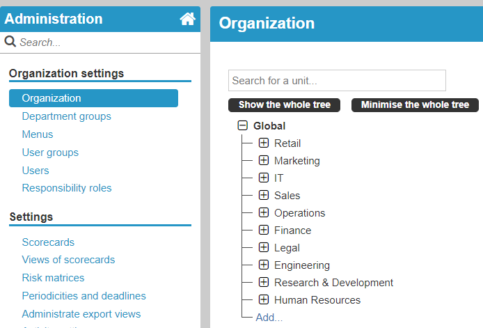
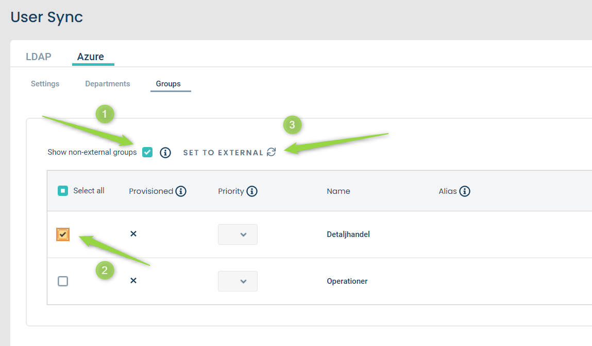
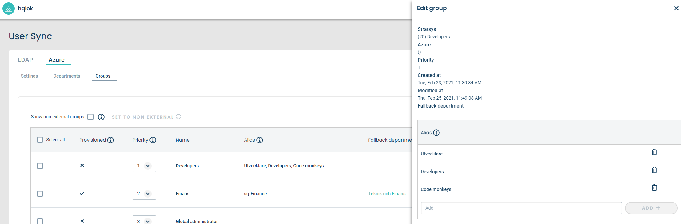
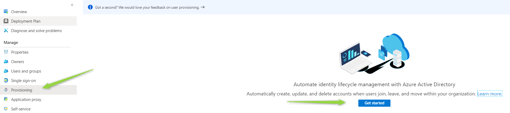
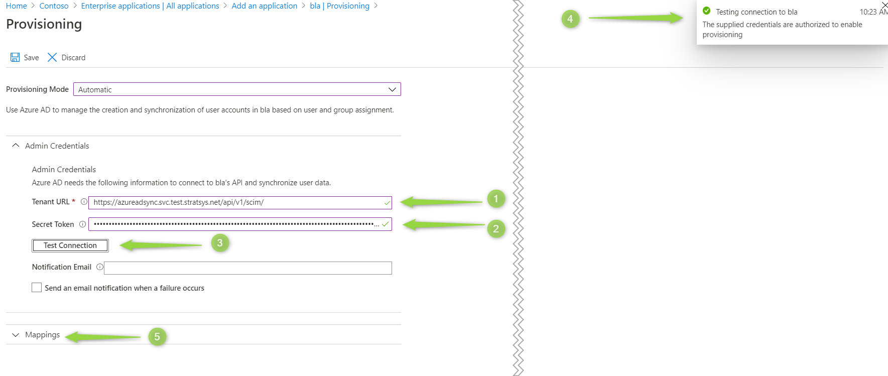
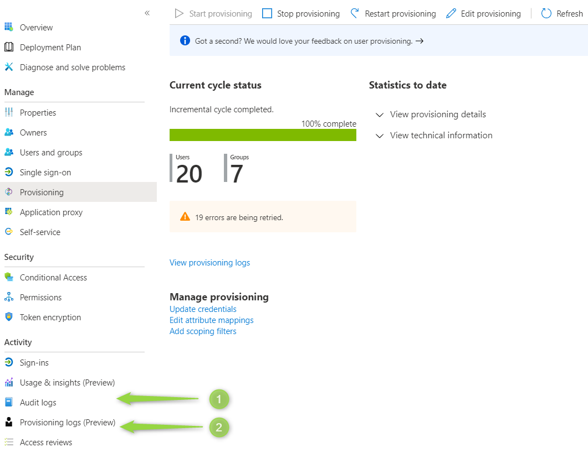
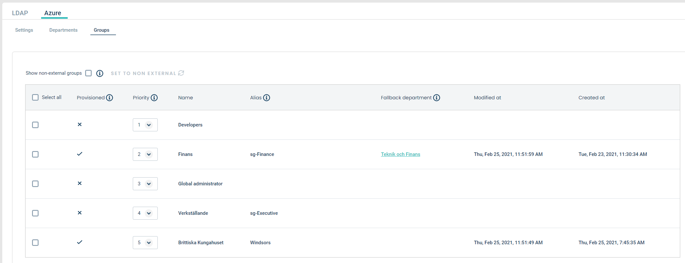

Setup
=====

- Azure AD Sync is an application that sits between Stratsys and Azure AD and enables a one way synchronization from Azure AD to Stratsys. 
- It has a `swagger <https://azureadsync.svc.stratsys.com/swagger/index.html>`_! 

Prerequisite
^^^^^^^^^^^^
- In Stratsys: 

   - The database needs to be **migrated**. Read more about it here: :ref:`Migrate customer`.
- The Azure AD license and groups meets the `requirements <https://docs.microsoft.com/en-us/azure/active-directory/manage-apps/assign-user-or-group-access-portal>`_ (see first *Note* section).

.. note:: Make sure you have the *correct urls* for the *correct environment*. Platform urls **in prodution** have the format http://[application].svc.stratsys.com. **Test** urls looks like this https://[application].svc.test.stratsys.net .

.. note:: If you want to sync users that are already created in the platform, the new and the old user must have matching **user name** or **e-mail**. Otherwise, a new user will be created.

Create an organization
^^^^^^^^^^^^^^^^^^^^^^

1. Start by logging in to https://stratsys/*companyCode* > **Administration** > **Organization** and create your *organization tree*.
2. This *organization tree* should mirror your Azure AD department structure. All departments in Azure AD needs to have a corresponding *alias* in Azure AD Sync. See `Group and department mapping <#mapping>`_ section.

		
	Stratsys organization tree.

.. tip:: In this example the *organization tree* mirrors the *Azure Demo Active Directory*, which I will use throughout the documentation. Create your own demo `here <https://cdx.transform.microsoft.com/my-tenants>`_.

Generate a key 
^^^^^^^^^^^^^^

1. Go to `Platform Administration <https://admin.svc.stratsys.com>`_ and click **User Sync** > **Settings** > **Activate directory synchronization**.
2. Under *Keys*, write the *Company code* and click **Generate token**.
3. Copy the *key* and store it in a safe place, since you won't be able to retrieve it later.
4. Copy the *Azure Ad Sync Url*  , you will need it later.

.. figure:: images/GenerateToken.png
	:width: 750
		
	Generate token.

Create and configure groups
^^^^^^^^^^^^^^^^^^^^^^^^^^^
Create
------

1. The groups are created in Stratsys and configured in Azure AD Sync.
2. After the groups are created in Stratsys, go to **Groups** and click **Show non-external groups**.
3. There, all groups from Stratsys are listed. Select the groups you want to use and click *Set to external*.

		
	Add group from Stratsys. 

4. The groups are listed as a **prioritized list**. When a user is assigned to a group, the priority determines if this group should be set as *main membership* or *extra membership* for this user. The user will get a new *membership* consisting of the new *group* and the same *department* as the *main membership*.
5. Each group also has a *department* mapped to it. This acts as a fallback when a user is assigned an unexisting department (it might have been misspelled, or simply not created in Stratsys). So if the group is the *main membership* for the user, its configured *department* is used.  

	
Configure
---------
	
1. Click on a group to see and edit its configuration.
2. All groups in Azure AD needs to have a corresponding *alias* in Azure AD Sync. If a group doesn't have an *alias*, the provisioning of this group will fail.	
3. The *alias* is the name of the corresponding Azure AD group. A group can have several aliases and hence map to several Azure AD groups.
4. An *alias* must be unique.

		
	Edit group.
	
Configure departments	
^^^^^^^^^^^^^^^^^^^^^

1. Departments also needs to have a corresponding *alias*, just as groups. 
2. Departments does not, however, need to be explicitly selected for provisioning (set as external). Instead they are automatically imported from Stratsys.

Create an Azure AD application
^^^^^^^^^^^^^^^^^^^^^^^^^^^^^^

1. Go to https://portal.azure.com . Select **Azure Active Directory** > **Enterprise applications** > **New application**
2. Select **Non-gallery application** > Enter a name of your choice, for example *StratsysAdSync*, and click **Add**.
3. Go to **Provisioning** > **Get started**

	
	New application in Azure AD.
	
4. Pick **Provisioning Mode Automatic** 
5. Paste the *Azure AD Sync url* **(1)** previously copied from the platform administration. 
6. Paste the *key* **(2)** previously copied from the platform administration.
7. Make sure the connection is correct by clicking **Test connection** **(3)**. Azure should indicate that everything was fine **(4)**.
8. Press Save at the top of the page.

    
	Azure AD application configuration.

8. Press **Save** at the top of the page.

Synhronize users and groups
^^^^^^^^^^^^^^^^^^^^^^^^^^^

1. Click **Provisioning** > **Start provisioning**. The synchronization will take a couple of minutes.
6. When the first cycle has finished you can see the outcome on the same page. :numref:`azure-initial-run` is an example of a not so successful run, since it has 19 errors. Check the logs under **(1)** and **(2)**.

	
	Azure initial cycle.

Synchronization done
^^^^^^^^^^^^^^^^^^^^
1. If no error was reported, you're done!
2. Return to the **Platform Administration** > **User Sync** > **Groups**.
3. You will now see your *synchronized groups*. They are marked as *provisioned* and has a *Modified at* and *Created at*.
	

    
	Synchronized groups.
	
4. Go to **Users** and make sure all users has been synchronized.

Resources
^^^^^^^^^
- Check the logs: https://logging.stratsys.net/app/kibana#/discover/d6165770-d463-11e9-a9ab-1940d6e09d7a 
- Troubleshoot: https://docs.microsoft.com/en-us/azure/active-directory/app-provisioning/application-provisioning-config-problem
- How provisioning works in Azure AD: https://docs.microsoft.com/en-us/azure/active-directory/app-provisioning/use-scim-to-provision-users-and-groups