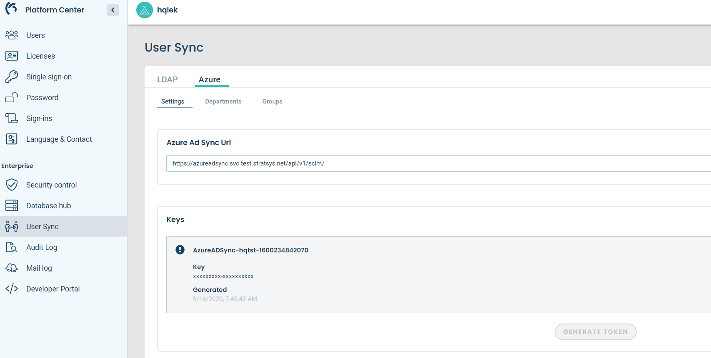

Setup
=====

- Azure AD Sync is an application that sits between Stratsys and Azure AD and enables a one way synchronization from Azure AD to Stratsys. 
- It has a `swagger <https://azureadsync.svc.stratsys.com/swagger/index.html>`_! 

Prerequisite
^^^^^^^^^^^^
- The stratsys database needs to be **migrated**. Read more about it here: :ref:`Migrate customer`.
- The Azure AD license and groups meets the `requirements <https://docs.microsoft.com/en-us/azure/active-directory/manage-apps/assign-user-or-group-access-portal>`_ (see first *Note* section).

.. note:: Make sure you have the *correct urls* for the *correct environment*. Platform urls **in prodution** have the format http://[application].svc.stratsys.com. **Test** urls looks like this https://[application].svc.test.stratsys.net .

Create an organization
^^^^^^^^^^^^^^^^^^^^^^

1. Start by logging in to https://stratsys/*companyCode* > **Administration** > **Organization** and create your *organization tree*.
2. This *organization tree* should mirror your Azure AD department structure. 

.. figure:: images/StratsysOrganization.png
		
	Figure 1. Stratsys organization.

.. tip:: In this example the *organization tree* mirrors the *Azure Demo Active Directory*, which I will use throughout the documentation. Create your own demo `here <https://cdx.transform.microsoft.com/my-tenants>`_.

3. Next, activate synchronization: **Administration** > **Users** > **Standard membership for new users** > check **Enable automatic user creation from the platform.**.
4. You also need to select a *main membership*.   for Stratsys, not Azure AD Sync. However, make sure you select a suitable *group*.
5. Select a standard department. This should be the same department as in the Administration, and will be used as a *fallback*. Explained `here <#configure-groups-and-departments>`_.

.. figure:: images/StratsysEnableUserCreation.png
			
	Figure 2. Enable automatic user creation from the platform.

Generate a key 
^^^^^^^^^^^^^^

1. Go to `Platform Administration <https://admin.svc.stratsys.com>`_ and click **User Sync** > **Settings** > **Activate directory synchronization** **(3)**.
2. Under *Keys*, write the *Company code* and click **Generate token** **(4)**.
3. Copy the *key* **(5)** and store it in a safe place, since you won't be able to retrieve it later.
4. Copy the *Azure Ad Sync Url* **(6)**  , you will need it later.

		
	Figure 3. Generate token.

	
Create an Azure AD application
^^^^^^^^^^^^^^^^^^^^^^^^^^^^^^

1. Go to https://portal.azure.com . Select **Azure Active Directory** > **Enterprise applications** > **New application**
2. Select **Non-gallery application** > Enter a name of your choice, for example *StratsysAdSync*, and click **Add**.
3. Go to **Provisioning** > **Get started**

.. figure:: images/StartProvisioningAAD.png
	
	Figure 4. New application in Azure AD.
	
4. Pick **Provisioning Mode Automatic** 
5. Paste the *Azure AD Sync url* **(1)** previously copied from the platform administration. 
6. Paste the *key* **(2)** previously copied from the platform administration.
7. Make sure the connection is correct by clicking **Test connection** **(3)**. Azure should indicate that everything was fine **(4)**.
8. Press Save at the top of the page.

.. figure:: images/AddTokenToAAD.png
    
	Figure 5. Azure AD application configuration.

8. Press **Save** at the top of the page.

Synhronize groups
^^^^^^^^^^^^^^^^^

1. Now it's time to select *groups* and *users* for synchronization. 
2. Because of a limitation in the system, in order to be able to configure *groups*, we need to **synchronize groups separately**.
3. We now have two choices: either we synchronize **empty groups**, or we **disable user synchronization**.
4. To **disable user synchronization**, go to **Mappings (5)**  (see *figure 5*), click **Provision Azure Active Directory Users** and uncheck all user actions (see *figure 6*). Then click **Save**.

.. figure:: images/UncheckUserActions.png
	:width: 500
    
	Figure 6. Uncheck user actions.
	
5. Now you're ready to synchronize your groups. Click **Provisioning** > **Start provisioning**. The synchronization will take a couple of minutes.
6. When the first cycle has finished you can see the outcome on the same page. *Figure 7* is an example of a not so successful run, since it has 19 errors. Check the logs under **(1)** and **(2)**.

.. figure:: images/AzureInitialRun.png
	
		Figure 7. Azure initial cycle.

Configure groups and departments
^^^^^^^^^^^^^^^^^^^^^^^^^^^^^^^^

1. If everything went fine, return to the **Platform Administration** > **User Sync** > **Settings**.
2. You will now see your synchronized groups (provided you have selected a **Standard department**).
3. The groups are listed as a **prioritized list**. Drag and drop a group to set its prioritity higher or lower. When a user is assigned to a group, the list determines if this group should be set as *main membership* or *extra membership* for this user.
4. Each group also has a *department* mapped to it. This acts as a fallback when a user is assigned a unexisting department (it might have been misspelled, or simply not created in Stratsys).
	
.. figure:: images/PlatformGroupAndDepartmentConfiguration.png
	:width: 500
    
	Figure 8. Platform group and department configuration.
	
5. The *standard department* is an additional fallback for the department that kicks in if the *main membership group has not been assigned a department*. This should match the standard department set in step 5 in `Create an organization <#create-an-organization>`_

Synchronize users
^^^^^^^^^^^^^^^^^

1. Go back to https://portal.azure.com
2. Press **Edit provisioning**.
3. Now it's time to sync the users. Re-enable user synchronization previously disabled in `step 4 in Synhronize groups <#synhronize-groups>`_.
4. Click **Restart provisioning**.
5. If no error was reported, you're done!

Resources
^^^^^^^^^
- Check the logs: https://logging.stratsys.net/app/kibana#/discover/d6165770-d463-11e9-a9ab-1940d6e09d7a 
- Troubleshoot: https://docs.microsoft.com/en-us/azure/active-directory/app-provisioning/application-provisioning-config-problem
- How provisioning works in Azure AD: https://docs.microsoft.com/en-us/azure/active-directory/app-provisioning/use-scim-to-provision-users-and-groups