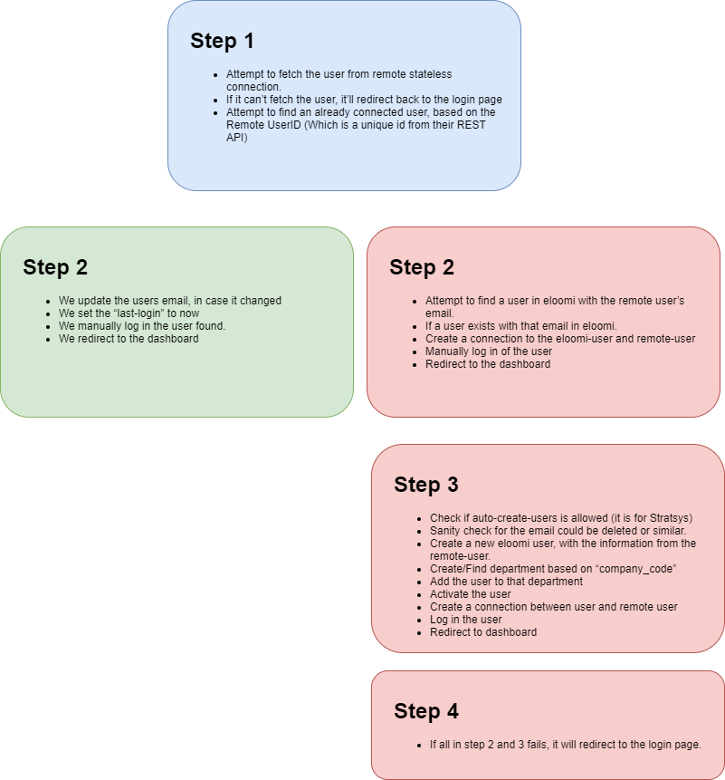

Eloomi - Stratsys integration
=============================

How does the integration work?
^^^^^^^^^^^^^^^^^^^^^^^^^^^^^^
* Eloomi e-learning is embedded within an iframe ('Stratsys external page') inside Stratsys web application. This url is manually added in `administration->menu->external pages`
* Url: https://stratsys.eloomi.com/stratsys/login?company_code=[companycode]
* Eloomi uses the companycode supplied in the URL above to access Stratsys IdP with the correct CompanyCode
* User signs into Eloomi with SSO by StratsysIdentityServer and using authorization code flow. A client for Eloomi is configured in platform developers and administrated by us
* If the user doesn't already exists in Eloomi, the user is created and assigned to a department in Eloomi that corresponds to the companycode in Stratsys

Eloomi "backbone domain"
^^^^^^^^^^^^^^^^^^^^^^^^
* "Single database-ish"
* `Customer` somewhat comparable to customer/tenant in our new Platform. It is what it sounds like and exists at https://[customer].eloomi.com
* Stratsys is a customer in Eloomi application
* A `customer` have one or many `departments`. A company code in Stratsys maps to a `department` in Eloomi
* A user belongs to a customer *BUT* there is also a unique constraint for e-mail which strongly hints at a single database as well as data isolation per customer does *NOT* include users (likely) or there is simply a constraint design flaw (less likely?)
* Stratsys is considered a "social login" in the same way as facebook, google etc
* However Stratsys architectural design is NOT the same as facebook, google etc. Instead every companycode should optimally be it's OWN social login the way user ids, usernames and e-mails are validated/stored internally and exposed publicly
* A user in Eloomi can have one or several "social logins" as connected logins. Both Stratsys and Facebook may exist at the same time
* A user in Eloomi can set a user password even if this is restricted in Stratsys for this specific company code and regulated through a signed contract between Stratsys and customer
* Question: If a user entity is NOT data isolated per tenant it suggests there might be a security exploit that a malicious user may be able to somehow gain access to user login for another customer. Does such a risk exist?
* Logout from Stratsys does NOT trigger logout in Eloomi

Pseudo code flow
^^^^^^^^^^^^^^^^

Environments
^^^^^^^^^^^^
* Stratsys production database: eloomitest, https://www.stratsys.se/eloomitest
* Eloomi production environment found at https://stratsys.eloomi.test
* Eloomi has a (non public) test instance found at https://stratsys.eloomi.test
* https://stratsys.eloomi.test/stratsys/login?company_code=eloomitest
* https://stratsys.eloomi.com/stratsys/login?company_code=eloomitest