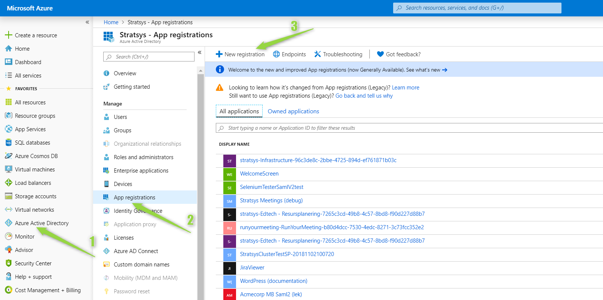
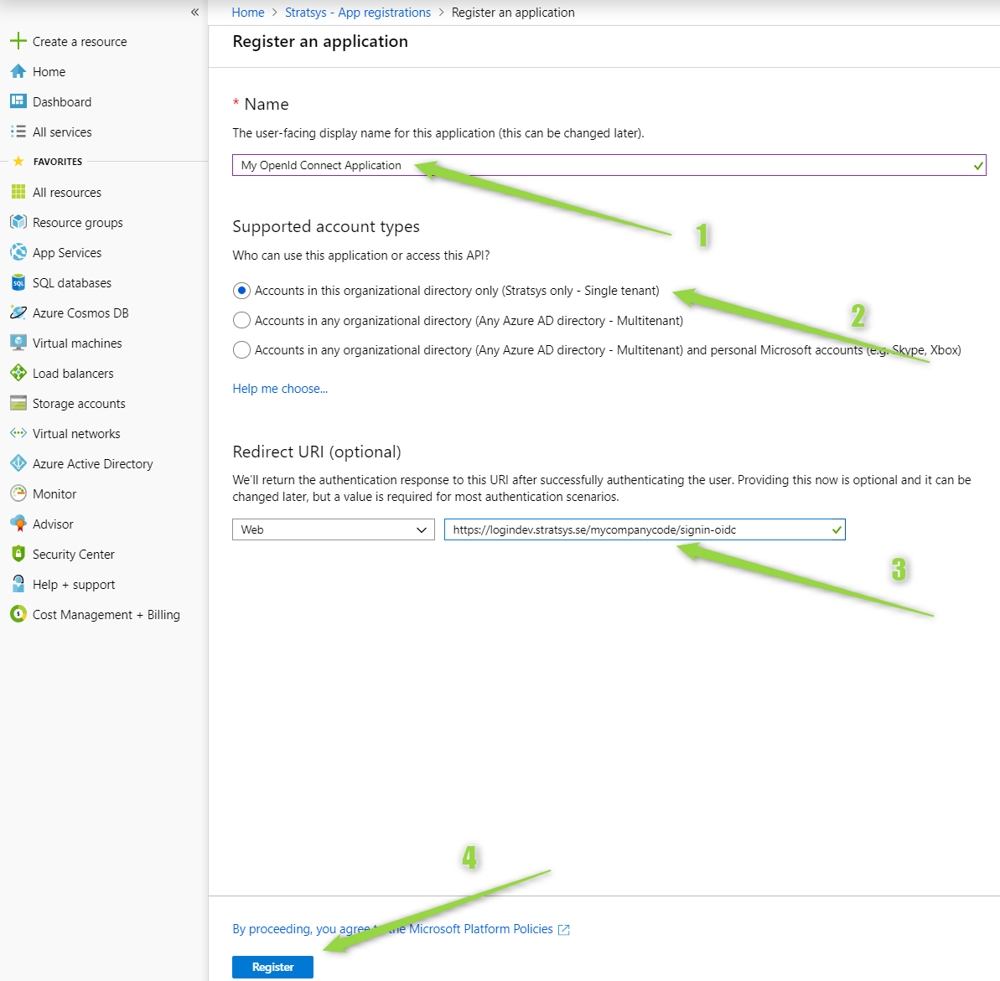
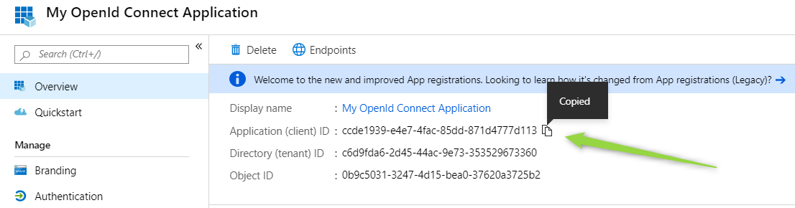
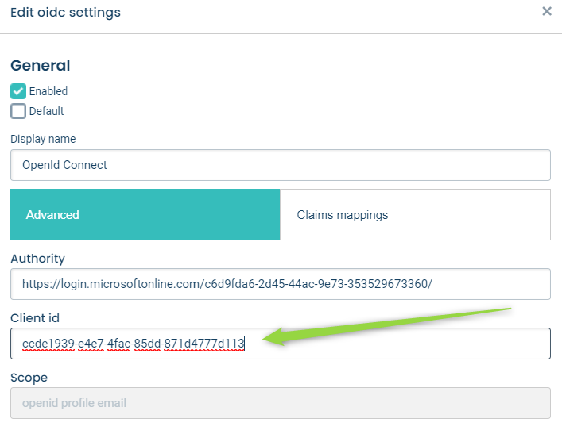
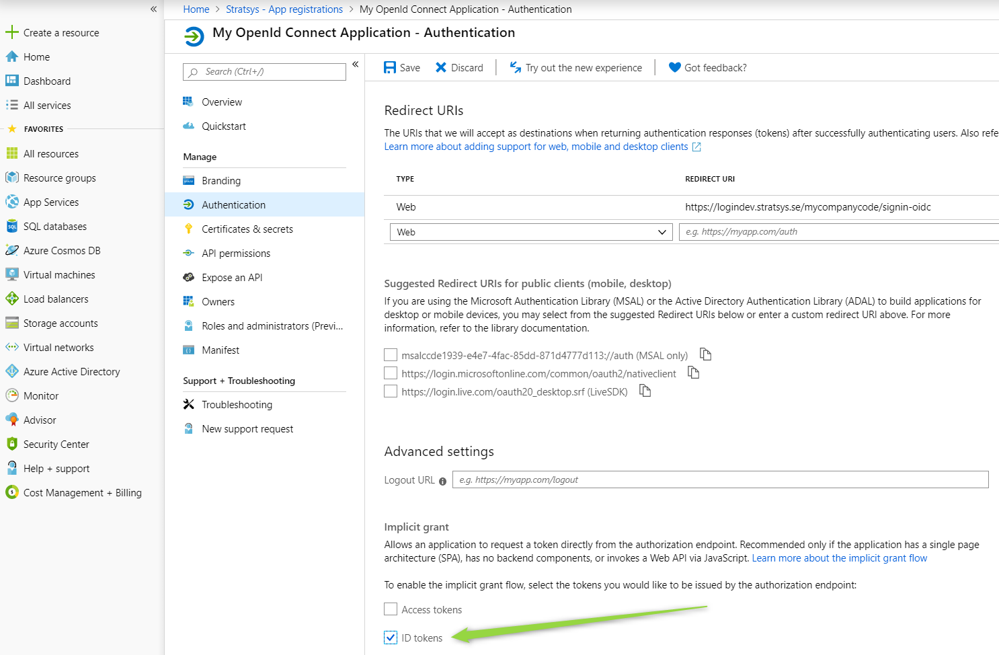

OpenID Connect
==============

- **Enabled**. If selected, the user can login using OpenID Connect.
- **Standard**. If selected, then OpenID Connect is the standard login method and will be used automatically when logging in.
- **Display name**. The text that is displayed to the users on the button for OpenID Connect.

Advanced
^^^^^^^^
- **Authority**. The *authority url* is the url to the *issuer* (or creator) of tokens.
- **Client id**. The client that is used when requesting tokens.
- **Scope**. The scopes are used to specify the access privileges when issuing a token.

.. _oidc-claims-mappings:

Claims mappings
^^^^^^^^^^^^^^^
- Map claims from *token response* to platform user.

.. note:: Claims mapping is only used in  `just-in-time user provisioning <#just-in-time-jit-user-provisioning>`_.

Just-in-time (JIT) user provisioning
^^^^^^^^^^^^^^^^^^^^^^^^^^^^^^^^^^^^

- Use *just-in-time user provisioning* to allow users logging in for the first time using single sign-on to automatically be created in the platform.
- The user is created according to the mapping made in `claims mappings <#claims-mappings>`_.
- Enabled by clicking *User provisioning* and click the *Just-in-time user provisioning* checkbox.
- *Email* falls back to *Username* if the latter is a valid e-mail address.

.. note:: Except for the fallback rules above, creation of users using user-provisioning follows the same rules as when creating user in the administration or using the api. This means that *First name* and *Last name* cannot be empty.

Configuration Azure AD
^^^^^^^^^^^^^^^^^^^^^^

1. Go to https://portal.azure.com

2. Register an *application*
   - The Redirect URI should be set to the *callback path* (the path within the application's base path where the user-agent will be returned).

3. Copy the ``Application (client) ID`` and paste it in the ``Client id`` field in the platform administration.

4. You also need to enable *ID tokens* to be issued by the authorization endpoint.

