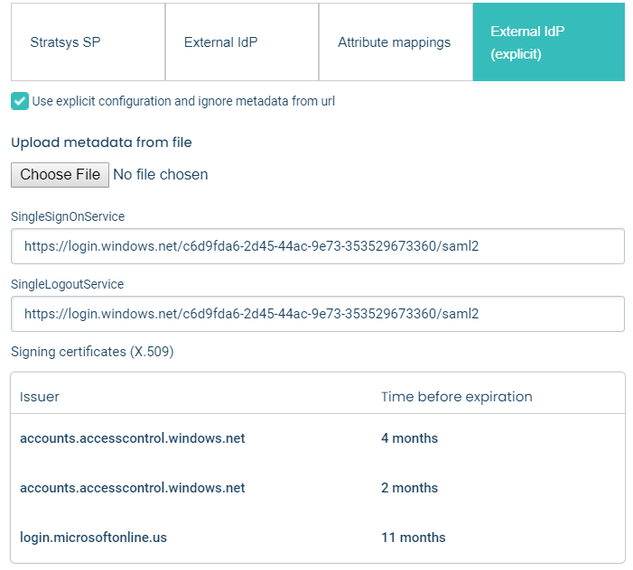
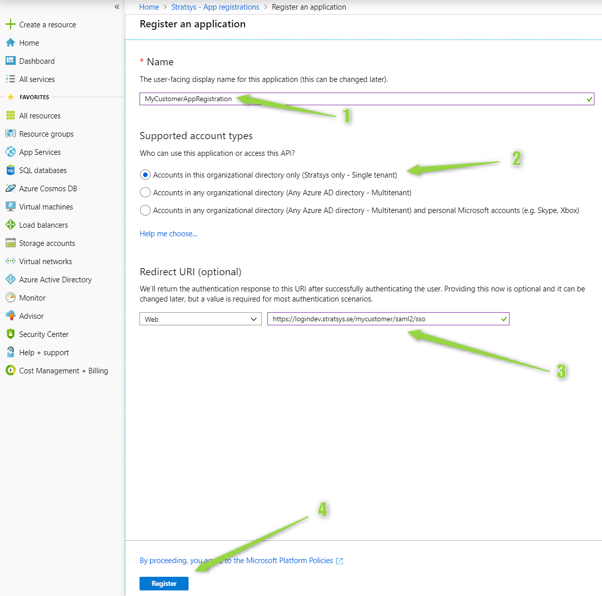
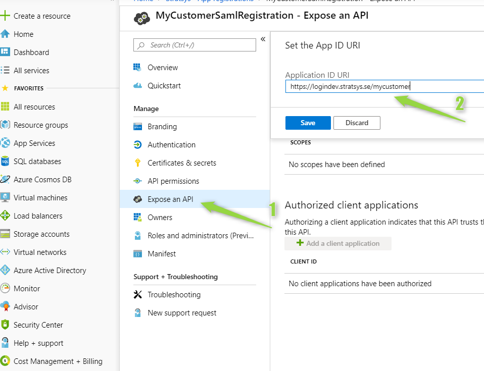
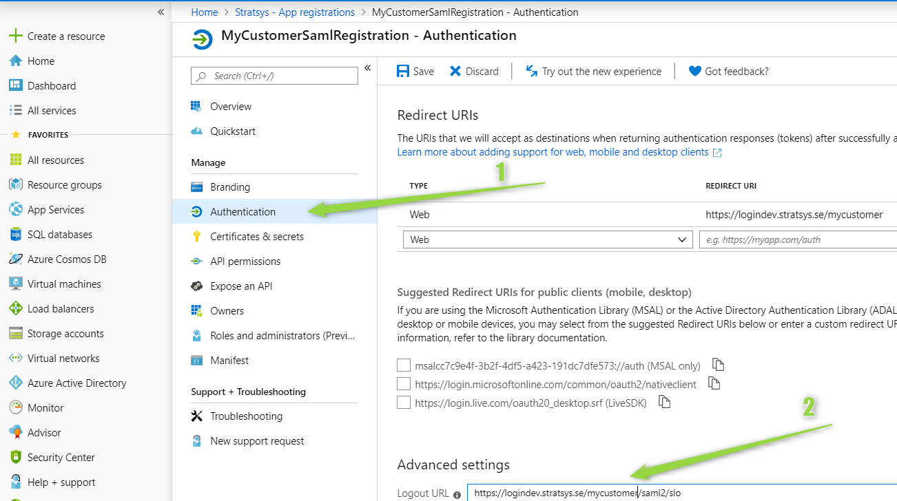

SAML2
=====

- **Enabled**. If selected, the user can login using saml2.
- **Display name**. The text that is displayed to the users on the button for saml2.

Stratsys SP
^^^^^^^^^^^
- **Metadata url**. This is the metadata that the Stratsys platform IdP publishes about itself. The format is ``https://login.stratsys.se/[tenantId]/saml2/spmetadata.xml`` where *tenantId* is the customer id in the platform.
- **Metadata version**. Stratsys provides several versions of metadata. Read more about the different versions `here <#metadata-versions>`_.
- **Enable single logout (SLO)**. When enabled a user sign out will trigger a sign out request from the customer's IdP.
- **Regex username**. Used if a customer needs to transform incoming claim for username. For example, ``^.*?(?=@)`` matches everything before "@".

External IdP
^^^^^^^^^^^^

- **Metadata url**. Insert your metadata url from you IdP here.

   - For example, Azure AD publishes federation metadata at ``https://login.microsoftonline.com/<TenantId>/FederationMetadata/2007-06/FederationMetadata.xml``.
   - A *thumbs up* next to the copy button will indicate that the metadata is valid. A *thumbs down* means the opposite.
     
  .. tip:: The metadata is cached up to 72 hours, but can be cleared by clicking **Clear cache**.

- **Use explicit configuration and ignore metadata from url**. If no public metadata url is available for your IdP, the configuration can also be made `manually <#external-idp-explicit>`_.
- **Name Identifier**. Defines the name identifier formats supported by the identity provider. For example, specify ``urn:oasis:names:tc:SAML:1.1:nameid-format:emailAddress`` to use the email address format.

External IdP (explicit)
^^^^^^^^^^^^^^^^^^^^^^^
- **Use explicit configuration and ignore metadata from url**. If checked, a file containing metadata needs to be provided. Bear in mind that this has the effect that the metadata might not be up to date.
- **Signing certificates (X.509)**. The certificate(s) for signing the SAML communication provided in the metadata. Certificates are clickable and can also be removed.

Attribute mappings   
^^^^^^^^^^^^^^^^^^

TODO
   
Metadata versions
^^^^^^^^^^^^^^^^^   

- New metadata versions are only added if some form of breaking change in our saml2 login handling is introduced regarding functionality or url's. Configuration of older metadata versions are supported as of now.
- ``MetadataUrl`` = ``https://login.stratsys.se/[tenantId]/saml2/spmetadata.xml``

.. note:: Although Stratsys provides several versions of metadata we recommend using the **latest configuration** (currently v3).

Metadata v3
-----------

Changes from earlier version:
-  Includes a public X509 certificate for signature validation. 

Metadata v2
-----------

Changes from earlier version:

- No proxy detour.
- ``EntityID`` = ``https://login.stratsys.se/[tenantId]``
- ``AssertionConsumerService`` = ``https://login.stratsys.se/[tenantId]/saml2/sso``
- ``SingleLogoutService`` = ``https://login.stratsys.se/[tenantId]/saml2/slo``

Metadata v1
-----------

Changes from earlier version:

- Supports logout.
- Supports multitenancy.
- ``EntityID`` = ``https://proxy.stratsys.se/[tenantId]/saml2``
- ``AssertionConsumerService`` = ``https://proxy.stratsys.se/[tenantId]/saml2``
- ``SingleLogoutService`` = ``https://proxy.stratsys.se/[tenantId]/saml2``

Metadata v0
-----------

- No support for log out.
- Same ``EntityID`` for all tenantId's.
- ``EntityID`` = ``https://proxy.stratsys.se/SAML2``
- ``AssertionConsumerService`` = ``https://proxy.stratsys.se/saml2``

Configuration Azure AD
^^^^^^^^^^^^^^^^^^^^^^
1. Go to https://portal.azure.com.
   - The ``EntityID`` is https://logindev.stratsys.se/mycustomer   
   - ``Assertion Consumer Service``is https://logindev.stratsys.se/mycustomer/saml2/sso

.. image:: images/saml2AzureAdNewAppRegistration.png
   
2. Register an *application*
   - The Redirect URI should be set to the ``Assertion Consumer Service``.

   
3. Set an *app ID*; the globally unique URI used to identify the app.

4. (Optional) Set a *logout url*. This is required for single sign-out to work correctly.

