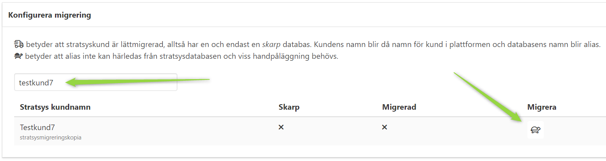
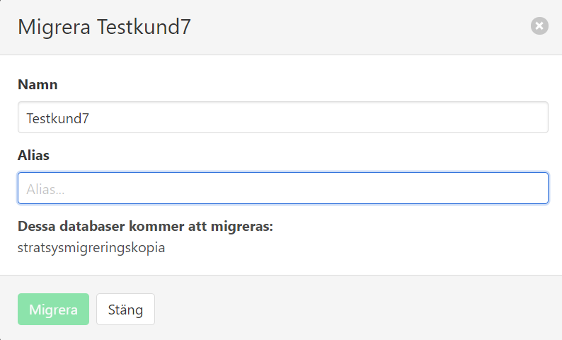
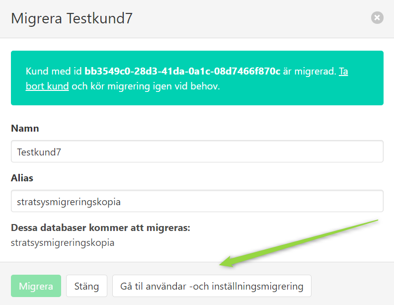

Migrate customer
================

Select customer
^^^^^^^^^^^^^^^

- Navigate to https://migrator.svc.dev.stratsys.net then click *Migrera kunder*.
- Search for the customer to migrate (can be customer name or database name). 
- Click on the turtle.

Set alias
^^^^^^^^^

- A popup will appear. Provide an alias for the new customer (if not already provided) and click *Migrera*.

Migrate 
^^^^^^^

- If everything went well, the tenant id to the newly created platform customer will be shown.
- Click the *Gå till användar -och inställningsmigrering* to go to the users and settings migration.

