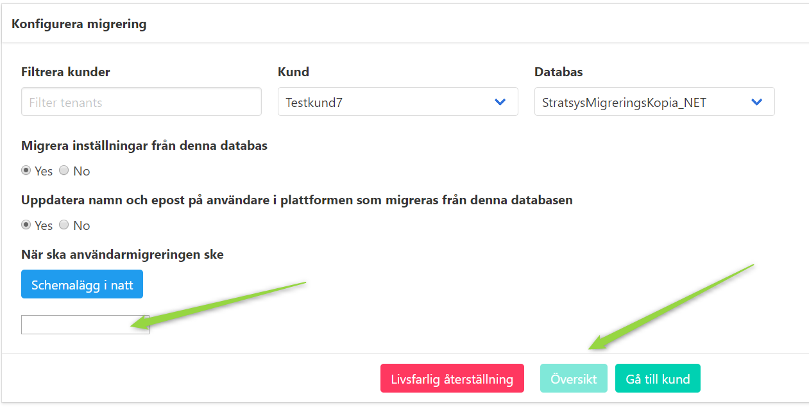
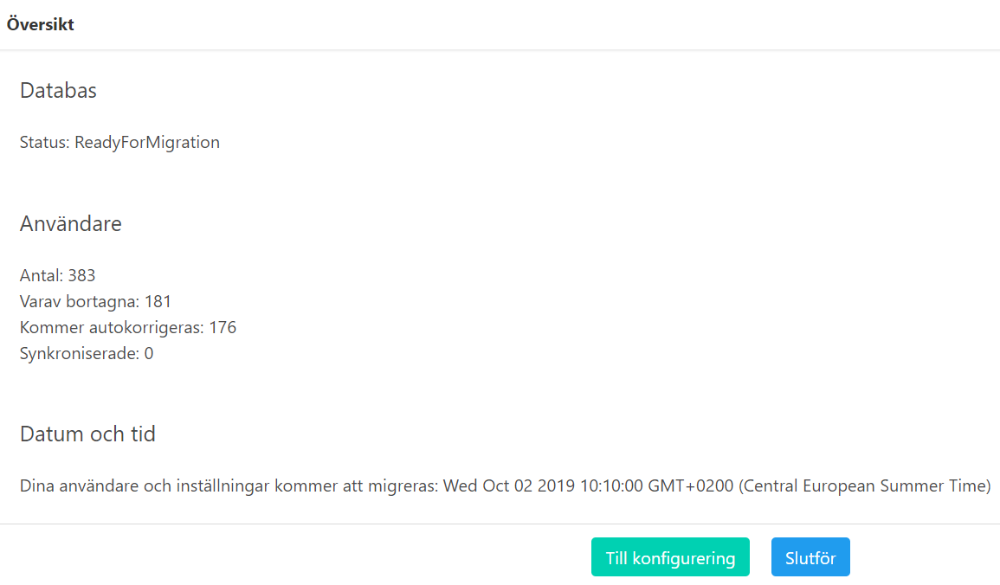
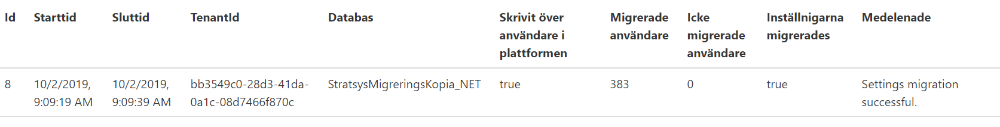

Migrate users and settings
==========================

Pick a database
^^^^^^^^^^^^^^^
- First, pick a customer (if you just migrated a customer, the *Kund* dropdown will be set to that customer.)
- Then, select database from dropdown *Databas*.
   

Pick a time
^^^^^^^^^^^

- Select (yes or no in radiobutton) if you want to migrate settings.
- Select time: either click the *Schemalägg i natt* or click the blank textbox to select time for migration.
- When the time is selected the *Översikt* button is clickable.

Migrate
^^^^^^^
- The overview page shows information about the database

  - How many users that will be migrated.
  - The migration status for the customer.
  - The time when the migration will start. 
- Click the *Slutför* to schedule the migration .

Report
^^^^^^

- The reports are found under *Rapporter*.
- It may take a while before the migration is done and the report is available and visible in the report list.

